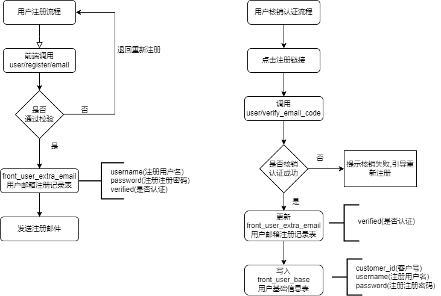

# chatgpt-django
基于django搭建的chatgpt后台服务


# ✨ 介绍

基于的 [chatgpt-web](https://github.com/Chanzhaoyu/chatgpt-web) 二次开发，适配[后台 chatgpt-django](https://github.com/AllenLuosong/chatgpt-django)，后续版本开发会在此项目上更新上线新功能


# ⏺️ 简易注册流程介绍




# 🔨构建运行

## 💾 环境准备


```shell
# Nginx sever的配置
    listen       80;
    listen  [::]:80;
    server_name  localhost;

    location /api/ {
        proxy_pass   http://chatgpt-django:9004/;
    }

```

```shell
# 克隆项目
git clone https://github.com/AllenLuosong/chatgpt-django

# 进入项目
cd chatgpt-django

# 复制一份配置文件
cp .env.example .env
#  填充apikey apibaseurl,及注册邮箱配置
vi .env 

# django数据库初始化
python manage.py makemigrations

# django数据库迁移同步
python manage.py migrate

# 使用docker-compose启动
docker-compose up -d 
```