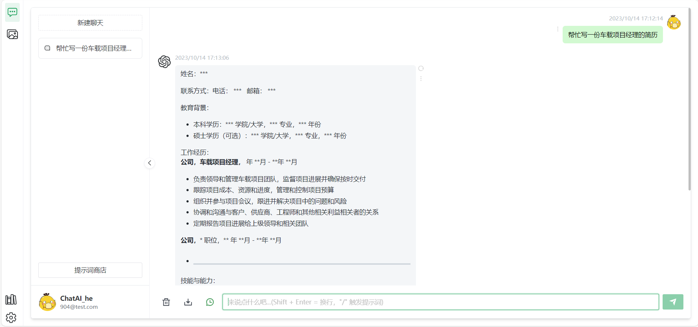
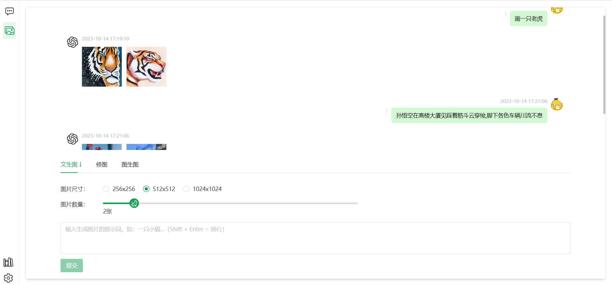
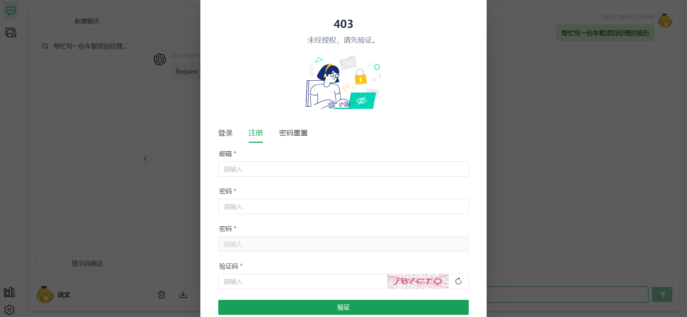

# chatgpt-django
基于django搭建的chatgpt后台服务
项目体验地址:  [网页Dmeo](https://wiki.hichat.shop/)
体验账号/密码: demo1@123.com/demo1018

# ✨ 介绍
基于的 [chatgpt-web](https://github.com/Chanzhaoyu/chatgpt-web) 二次开发，适配[后台 chatgpt-django](https://github.com/AllenLuosong/chatgpt-django)，后续版本开发会在此项目上更新上线新功能


# 💡 页面截图

聊天页面



绘画页面



登录注册页面



# ⏺️ 简易注册流程介绍


# 🔨构建运行

## 💾 环境准备


```shell
1. # 克隆项目

2. # 进入项目
cd chatgpt-django

3. # 填写init.sql文件的配置项
目前咱没有兜底 api key 请填写自己的api key

4. # django数据库初始化
python manage.py makemigrations

5. # django数据库迁移同步
python manage.py migrate

6. # 使用docker-compose启动
docker-compose up -d 
```